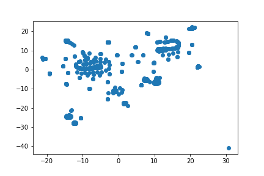
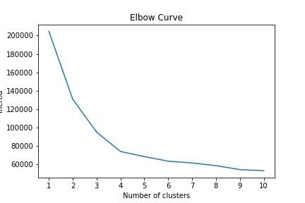

# Cryptocurrency Clusters

  

## Background

* You are on the Advisory Services Team of a financial consultancy. One of your clients, a prominent investment bank, is interested in offering a new cryptocurrency investment portfolio for its customers. The company, however, is lost in the vast universe of cryptocurrencies. They’ve asked you to create a report that includes what cryptocurrencies are on the trading market and determine whether they can be grouped to create a classification system for this new investment.

* You have been handed raw data, so you will first need to process it to fit the machine learning models. Since there is no known classification system, you will need to use unsupervised learning. You will use several clustering algorithms to explore whether the cryptocurrencies can be grouped together with other similar cryptocurrencies. You will use data visualization to share your findings with the investment bank.

## Instructions

### [Data](resources/crypto_data.csv) Preparation

* Read `crypto_data.csv` into Pandas. The dataset was obtained from [CryptoCompare](https://min-api.cryptocompare.com/data/all/coinlist).

* Filter for currencies that are currently being traded. Since we only want to use coins that are openly being traded.

* Filter for cryptocurrencies that have been mined.

* In order for your dataset to be comprehensible to a machine learning algorithm, its data should be numeric. So get rid of all columns with non-numeric data such as crypto names.

* Your next step in data preparation is to convert the remaining features with text values into numerical data.

* Standardize your dataset so that columns that contain larger values do not unduly influence the outcome.

### Dimensionality Reduction

* Creating dummy variables above dramatically increased the number of features in your dataset. Perform dimensionality reduction with PCA. Rather than specify the number of principal components when you instantiate the PCA model, it is possible to state the desired **explained variance**. For example, say that a dataset has 100 features. Using `PCA(n_components=0.99)` creates a model that will preserve approximately 99% of the explained variance, whether that means reducing the dataset to 80 principal components or 3. For this project, preserve 90% of the explained variance in dimensionality reduction. This made the amount of features go from 99 to 74.

* Next, further reduce the dataset dimensions with t-SNE and visually inspect the results. In order to accomplish this task, run t-SNE on the principal components: the output of the PCA transformation. Then create a scatter plot of the t-SNE output. Observe whether there are distinct clusters or not. Distinct clusters are observed.

  

### Cluster Analysis with k-Means

* Create an elbow plot to identify the best number of clusters. Use a for-loop to determine the inertia for each `k` between 1 through 10. Determine, if possible, where the elbow of the plot is, and at which value of `k` it appears. Best K value would be 4 based on my findings.

  

### Recommendation

           
Analysis

           
Based on my findings it would be safe to say that cryptocurrencies can be clustered together. The best amount of clusters based on my findings would be 4.

